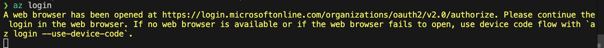
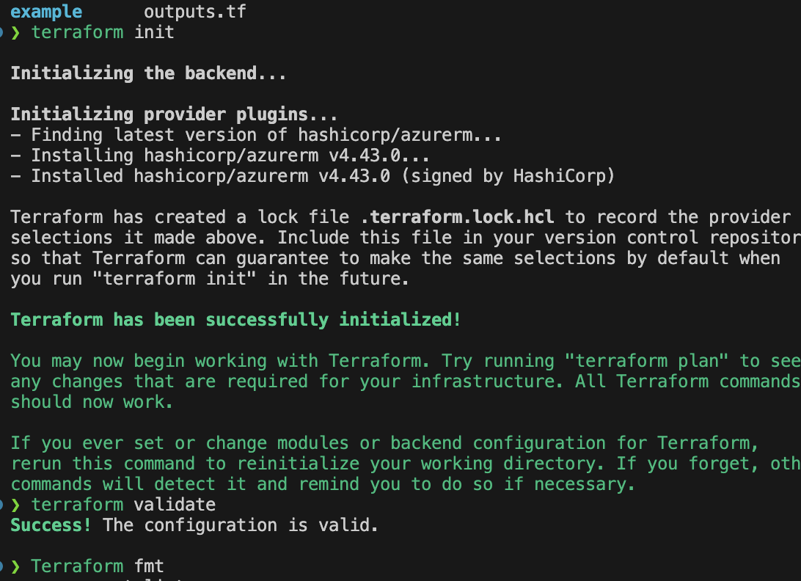
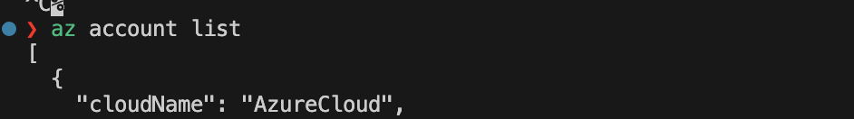
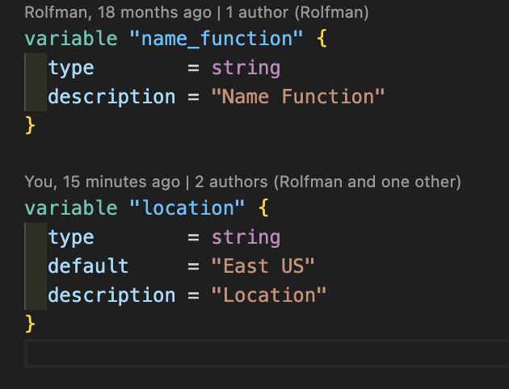
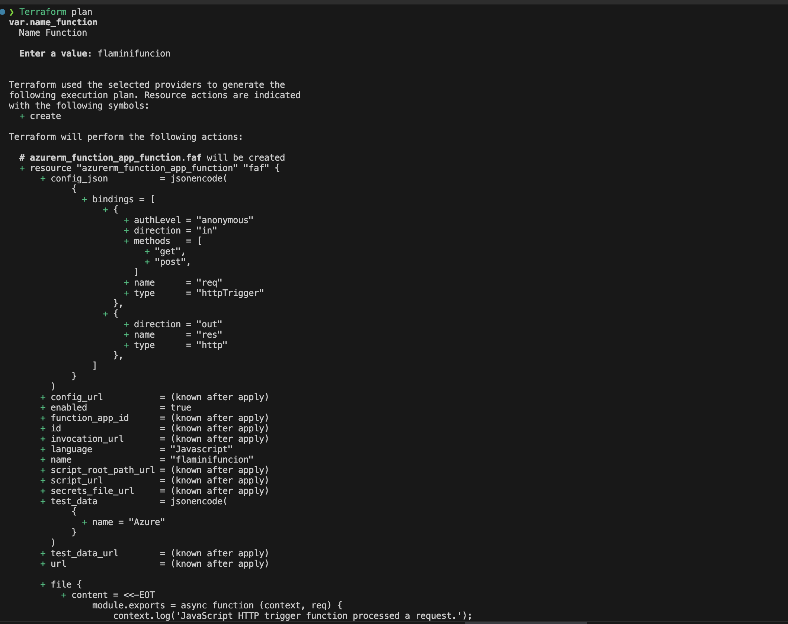
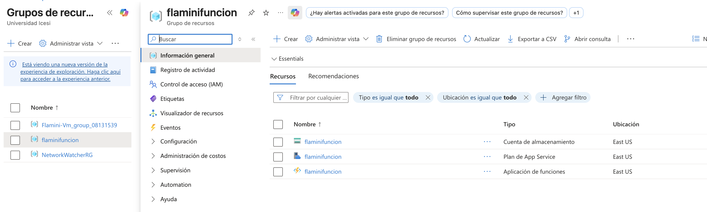
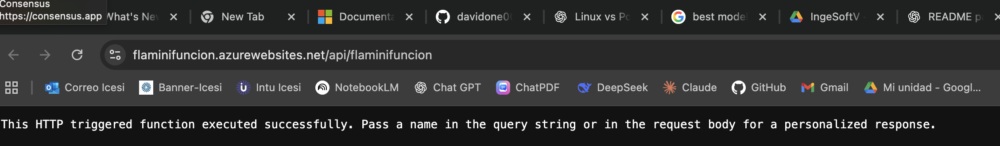
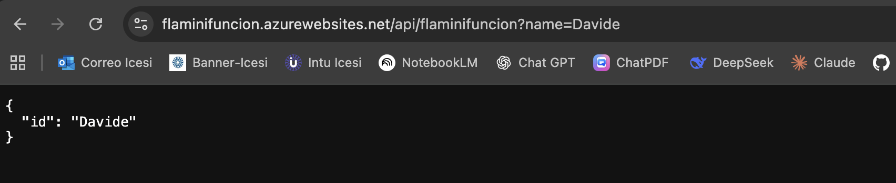

# Despliegue de mi primera Azure Function con Terraform

**Autor:** Davide Flamini


**Curso:** IngeSoft V

## Descripción

En este trabajo realicé la creación de mi primera **Azure Function** utilizando **Terraform** como herramienta de IaC (Infraestructura como Código) y **Azure CLI** para la autenticación.

El objetivo fue entender el flujo completo de despliegue: autenticación en Azure, inicialización de Terraform, validación, definición de variables, aplicación de la infraestructura y verificación final en el portal de Azure.

---

## Pasos realizados

### 1. Autenticación en Azure

El primer paso fue conectarme a mi cuenta de Azure con:

```bash
az login
```

Esto abrió el navegador donde inicié sesión con mi cuenta de estudiante de **Universidad Icesi**.



---

### 2. Inicialización y validación de Terraform

Ejecuté los siguientes comandos para preparar el entorno:

```bash
terraform init
terraform validate
terraform fmt
```

* `init`: Inicializa el directorio de trabajo y descarga los proveedores necesarios.
* `validate`: Revisa que la sintaxis de los archivos `.tf` sea correcta.
* `fmt`: Formatea los archivos para mantener un estilo uniforme.



---

### 3. Selección de la suscripción de Azure

Con el comando:

```bash
az account list
```

Obtuve la lista de suscripciones y copié el campo `"id"` correspondiente a mi **Azure for Students**.

Ese `subscription_id` lo agregué en el archivo `main.tf`:

```hcl
provider "azurerm" {
  features {}
  subscription_id = "xxxxxxxx-xxxx-xxxx-xxxx-xxxxxxxxxxxx"
}
```



---

### 4. Definición de la región

Si la región no me funciona, actualicé la variable `location` en el archivo `variables.tf`:

```hcl
variable "location" {
  type        = string
  default     = "East US"
  description = "Location"
}
```



---

### 5. Plan de ejecución

Generé el plan para revisar qué recursos se iban a crear:

```bash
terraform plan
```

Aquí definí el nombre de mi función como:

```
flaminifuncion
```



---

### 6. Aplicación de la infraestructura

Ejecuté:

```bash
terraform apply
```

Terraform mostró un resumen de recursos a crear y me pidió confirmación. Ingresé `yes` para continuar.


---

### 7. Verificación en Azure

Después de unos minutos, la función quedó desplegada en mi suscripción de Azure.
Entré al [Portal de Azure](https://portal.azure.com/) y confirmé que la **Azure Function** estaba creada correctamente.





---

### 8. Prueba de la Azure Function desde el navegador

Abrí la URL de la función en el navegador:

```
https://flaminifuncion.azurewebsites.net/api/flaminifuncion?name=Davide
```

La respuesta fue un JSON con el parámetro enviado:

```json
{
  "id": "Davide"
}
```


---

### 9. Captura de la respuesta en el navegador

A continuación se muestra la captura de la respuesta de la Azure Function vista directamente en el navegador:



---

## Repositorio base

Todo el trabajo lo basé en el siguiente repositorio:
[https://github.com/ChristianFlor/azfunction-tf](https://github.com/ChristianFlor/azfunction-tf)

---


